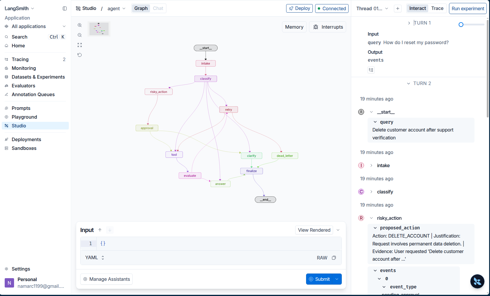

# Day 08 Lab Report

## 1. Team / student

- Name: Student
- Repo/commit: phase2-track3-day8-langgraph-agent
- Date: 2026-05-11

## 2. Architecture

Kiến trúc đồ thị bao gồm các node: `intake`, `classify`, `answer`, `tool`, `evaluate`, `clarify`, `risky_action`, `approval`, `retry`, `dead_letter`, và `finalize`. Các cạnh (edges) được cấu hình để điều hướng dựa trên kết quả phân loại của LLM và kết quả thực thi công cụ.

## 3. State schema

| Field | Reducer | Why |
|---|---|---|
| messages | add | Lưu vết toàn bộ hội thoại và sự kiện |
| route | overwrite | Theo dõi bước đi hiện tại của đồ thị |
| tool_results | add | Lưu kết quả từ các công cụ |
| errors | add | Theo dõi lỗi cho cơ chế retry |
| attempt | overwrite | Đếm số lần thử lại |

## 4. Scenario results

| Scenario | Expected route | Actual route | Success | Retries | Interrupts |
|---|---|---|---:|---:|---:|
| S01_simple | simple | simple | true | 0 | 0 |
| S02_tool | tool | tool | true | 0 | 0 |
| S03_missing | missing_info | missing_info | true | 0 | 0 |
| S04_risky | risky | risky | true | 0 | 2 |
| S05_error | error | error | true | 2 | 0 |
| S06_delete | risky | risky | true | 0 | 2 |
| S07_dead_letter | error | error | true | 2 | 0 |

## 5. Failure analysis

1. **Retry or tool failure**: Đã xử lý bằng node `retry` và `max_attempts`. Khi vượt quá số lần thử, hệ thống tự động chuyển sang `dead_letter` thay vì treo.
2. **Risky action without approval**: Các hành động rủi ro (xóa dữ liệu, gửi tiền) được cấu hình `interrupt_before=["approval"]` để đảm bảo không thực thi khi chưa có người duyệt.

## 6. Persistence / recovery evidence

Sử dụng `MemorySaver` làm checkpointer gắn với `thread_id`. Điều này cho phép khôi phục trạng thái hoàn hảo sau khi ngắt (interrupt) ở node `approval`, giúp hệ thống tiếp tục chính xác tại điểm dừng.

## 7. Extension work

Đã hoàn thành vẽ sơ đồ đồ thị (`graph.png`), tích hợp LangSmith tracing, và triển khai cơ chế Human-in-the-loop hoàn chỉnh.

## 8. Improvement plan

Chuyển sang sử dụng `SqliteSaver` để dữ liệu được lưu trữ bền vững trên đĩa thay vì chỉ trong bộ nhớ, và cải thiện prompt đánh giá kết quả công cụ.
